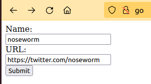

# golinks

A service that converts long URLs into memorable names.



## Install

```sh
go install github.com/belljustin/golinks
```

## Run

The following runs golinks with an in-memory datastore.
See Configuration for more options.

```sh
golinks
```

### Migration

Some storage backends require running a migration.

`golinks migrate`

## Deploy

- [AWS SAM](./build/aws) - deploy golinks as an AWS serverless application.

## Configuration

Configuration is managed by environment variables.

- GOLINKS_PORT
  - Specifies which port the application listens on.
  - default: `8080`
  - e.g. `8081`
- GOLINKS_STORAGE_TYPE
  - Specifies which storage backend is used to maintain the links. See the Storage subsection for more information.
  - default: `memory`
  - options: `memory`, `dynamodb`

### Memory
`GOLINKS_STORAGE_TYPE=memory`

No further configuration.

This is primarily for development purposes.
All links are stored in a in-memory hashmap.
Data is lost when the application is terminated.

#### Migration

Running migration with this storage backend is a no-op.

### Dynamodb
`GOLINKS_STORAGE_TYPE=dynamodb`

Uses Amazon Web Services' (AWS) DynamoDB to maintain the links.
You can specify your [Amazon Credentials](https://docs.aws.amazon.com/sdk-for-go/v1/developer-guide/configuring-sdk.html#specifying-credentials) in the typical fashion.
The IAM user must have at least have access to read and write to the `GOLINKS_STORAGE_TABLENAME`.
The IAM user must also be able to create tables to run the migration.

- GOLINKS_STORAGE_REGION
  - Specifies the AWS region to use.
  - default: `us-west-2`
- GOLINKS_STORAGE_ENDPOINT
  - Specifies the AWS endpoint to use.
  - default: `http://localhost:8000`
  - e.g. `https://dynamodb.us-west-2.amazonaws.com`
- GOLINKS_STORAGE_TABLENAME
  - Specifies the name of the DynamoDB table to use.
  - default: `Links`
  - e.g. `GoLinksLinks`

#### Migration

Running migration with this storage backend creates the DynamoDB table specified by `GOLINKS_STORAGE_TABLENAME`.
If the table already exists, this is a no-op.